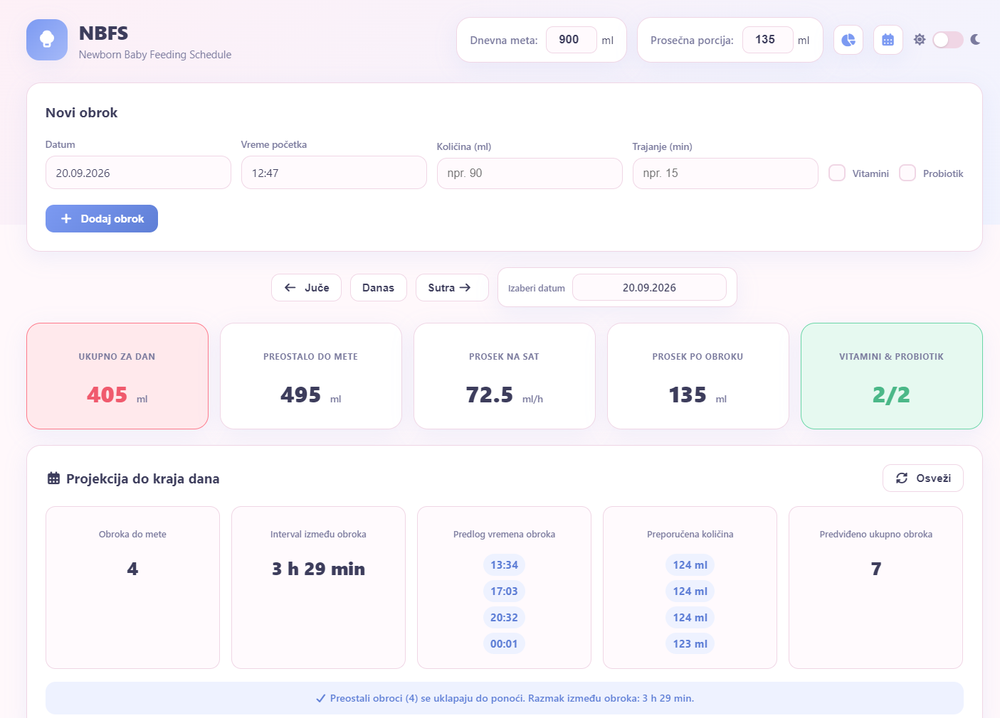

# NBFS — Newborn Baby Feeding Schedule

Jednostavna desktop aplikacija za praćenje unosa mleka kod novorođenčadi. Razvijena u Electron-u, čuva podatke lokalno u SQLite bazi i može se pokrenuti kao portable `.exe` bez instalacije.



> Aplikacija trenutno ima interfejs na srpskom jeziku.

## Funkcionalnosti

- **Unos obroka** — datum, vreme početka, količina u ml, trajanje u minutima, vitamini i probiotik
- **CRUD operacije** — dodavanje, izmena i brisanje obroka
- **Navigacija po danima** — dugmići Juče / Danas / Sutra i date picker
- **Statistike za izabrani dan**:
  - Ukupno za dan
  - Preostalo do dnevne mete
  - Prosek na sat
  - Prosek na 3 sata
  - Vitamini & Probiotik (`0/2`, `1/2`, `2/2`)
- **Indikacija ukupnog unosa po bojama** — zelena (meta dostignuta), žuta (manje od 50 ml do mete), crvena (više od 50 ml do mete)
- **Projekcija do kraja dana** — na osnovu preostale količine, prosečne porcije i poslednjeg obroka predlaže:
  - broj obroka potrebnih da se dostigne meta
  - prilagođeni interval između obroka (smanjuje se kada je potrebno da se izbegnu prevelike porcije)
  - predlog vremena narednih obroka
  - raspodeljenu preporučenu količinu po obrocima (npr. `40 + 39 ml`)
  - predviđeni ukupan broj obroka tog dana
  - kada nije unet nijedan obrok, prikazuje samo preporučenu količinu po obroku
- **React date/time picker-i** — lokalizovani na srpski, format datuma `DD.MM.YYYY`, prvi dan u nedelji je ponedeljak
- **Podesive vrednosti** — dnevna meta i prosečna porcija

## Tehnologije

- [Electron](https://www.electronjs.org/) 30
- [better-sqlite3](https://github.com/WiseLibs/better-sqlite3)
- [React](https://react.dev/) + [react-datepicker](https://reactdatepicker.com/) + [date-fns](https://date-fns.org/)
- [Font Awesome](https://fontawesome.com/) — ikonice
- [esbuild](https://esbuild.github.io/)
- [electron-builder](https://www.electron.build/)

## Pokretanje u razvoju

```bash
npm install
npm start
```

## Build portable `.exe`

```bash
npm run dist
```

Izvršna datoteka se nalazi u `dist/` folderu:

```
dist/NBFS 1.0.0.exe
```

## Struktura projekta

```
NBFS/
├── src/                 # Izvorni kod aplikacije
│   ├── main.js          # Electron main proces
│   ├── preload.js       # IPC bridge
│   ├── database.js      # SQLite logika
│   ├── renderer.js      # Frontend logika
│   ├── index.html       # UI
│   ├── styles.css       # Stilovi
│   ├── picker-entry.jsx # React picker komponente
│   ├── picker.bundle.js # Bundle-ovani React pickeri
│   └── picker.bundle.css
├── AGENTS.md            # Detaljna dokumentacija za agente
├── package.json
└── README.md
```

## Napomena

Baza se čuva lokalno u Electron-ovom `userData` folderu (`nbfs.db`).

## Licenca

MIT
